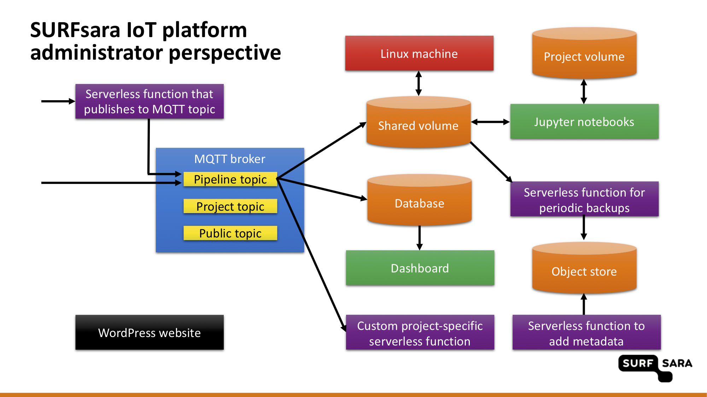

# Data

For the messages sent to the `pipeline` topic defined in the MQTT broker, or to the HTTP entry point, the [automated data pipeline](#automated-data-pipeline) takes care of automatic re-distribution into the platform's storage services. In order to enable the automated processing, the incoming data has to be standardised (see the section on the [data format](#data-format)).

This section describes all the data formats used in the **SURFsara IoT platform for Sensemakers** and explains how data is organised/stored at different levels.
The following table gives a high-level overview.

| **Data store** | **Data format** | **Purpose** | **Availability of new data** | **Retention period** |
| :---- | :---- | :---- | :---- | :---- |
| Mosquitto (pipeline topic) | standardised JSON format | automated data pipeline, real-time data consumption | real-time | |
| Mosquitto (other topics) | any format | real-time data consumption | real-time | |
| InfluxDB | Time series | visualisation and time series queries | real-time | 90 days |
| Shared volume | JSON | sort messages on the project/device/date basis, programmatic analysis with Jupyter notebooks | real-time | long-term |
| Minio (data) | JSON | programmatic analysis of sensor data | on a daily basis | long-term |
| Minio (metadata) | JSON | programmatic analysis of sensor metadata | on a daily basis | long-term |


## Data format

The messages entering the platform through the `pipeline` topic are required to be in a JSON format compatible with the following schema:

```
{
    "type": "object",
    "properties": {
        "app_id": {
            "type": "string"
        },
        "dev_id": {
            "type": "string"
        },
        "time": {
            "type": "integer”
        },
        "payload_fields": {
            "type": ”object"
        },
        "tag_fields": {
            "type": ”object"
        }
    },
    "required": [
        "app_id",
        "dev_id",
        "payload_fields"
    ]
}
```

The individual fields correspond to:
- `app_id`: unique project identifier (project name) within the platform
- `dev_id`: unique device identifer (device name) within the project
- `time`: timestamp (in milliseconds since unix epoch) of the measurement
- `payload_fields`: key-value pairs (JSON) corresponding to the quantity names and measured values
- `tag_fields`: kay-value pairs (JSON) that will be useful to identify different time series in InfluxDB (see the [InfluxDB fields and tags](#influxdb-fields-and-tags) section for more details)
- custom fields: additionals field are allowed and will be stored in the raw data files.

The automated pipeline uses a topic composed of `pipeline/app_id/dev_id`. The messages where `app_id` and `dev_id` does not coincide with the identifiers specified in the topic will be ignored.


## Automated data pipeline

An automated data pipeline is in place to re-distribute the data entering the platform into the platform's storage components. The automated pipeline is realized in three stages: acting on the data arriving in Mosquitto in the `pipeline` topic, copying data to the Minio object store on a daily basis and acting on the data files arriving in Minio.

**Acting on the incoming MQTT messages**
- Write every incoming message one-by-one to the InfluxDB time-series database (see the [InfluxDB fields and tags](#influxdb-fields-and-tags) section for more details).
- Write raw messages to the shared volume. The individual messages are appended to files for a given project/device and a calendar date. It is the date of the arrival of each message to the data platform that determines to which file the message is appended, not the actual timestamp reported in the message. The naming convention for the directories/files is `/data/app_id/dev_id-YYYY-mm-dd.json`. The shared volume is in place for the following two reasons: aggreage messages before uploading to Minio, provide a shared location with raw messages accessible from Jupyter notebooks.
- Invoke a serverless function at `https://openfaas.sensemakersams.org/async-function/app_id`. This is a placeholder for each project and an OpenFaaS function with such name can be deployed by the platform administrator to enable event-driven actions.

**Copying data to Mino**
- A cron job is running every night to copy all data files from the shared volume from the previous day into Minio into the `data` bucket.

**Acting on the files in arriving in Minio:**
- For every new data file that is uploaded into the `data` bucket in Minio, extract metadata (see the [Metadata in Minio](#metadata-in-minio) section for more information).

The full picture of the platform, including all components of the automated data pipeline, is shown below:




## InfluxDB fields and tags

Data points in InfluxDB arrive in real time and the intention is to use them primarily for visualisations. Data is kept in InfluxDB for 90 days and can be downloaded in a CSV format.

All quantities from a message are stored in InfluxDB in a *measurement* corresponding to the device. The name of the *measurement* is defined by `dev_id`. The InfluxDB *measurement* entries consist of time, fields and tags. Tags are useful to quickly organise *measurements* into separate *series* in InfluxDB.
- Time is taken from `time`, i.e. it is the actual time of the measurement, not the time of the arrival of the message in the platform.
- Fields:
  - all key-value pairs from `payload_fields`
- Tags:
  - `dev_id`
  - all key-value pairs from `tag_fields`


## Metadata in Minio

For every raw data file stored in Minio, metadata is extracted and stored in the `metadata` bucket. There is one metadata file for every data file, with the same naming convention, i.e. `app_id/dev_id-YYYY-mm-dd.json`. The following information is available in metadata:
- `app_id` and `dev_id`
- `date_start` and `date_end` give the data range of the actual measurements stored in the data file. Because the date of the arrival of each message to the data platform that determines in file the message is stored, a single file can contain measurements taken on different days (e.g. from a battery-powered device sending data in batches once in a while).
- `keys` listing the available quantities measured by the device
- `num_events` for the number of messages in the data file

Example metadata file:

```
{
    "filename": "test_project/test_device-2019-05-21.json",
    "date_start": "2019-05-21",
    "date_end": "2019-05-21",
    "app_id": "test_project",
    "dev_id": "test_device",
    "keys": [
        "conductivity",
        "light",
        "moisture",
        "temperature"
    ],
    "num_events": 3
}
```
