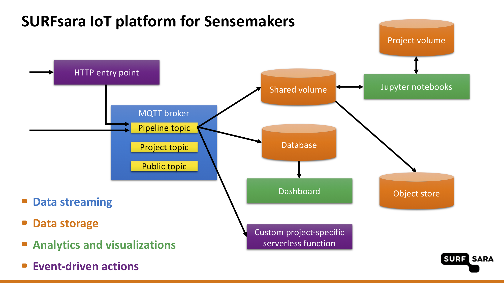

# SURFsara IoT Platform for Sensemakers

Sensemakers make use of the IoT data streaming and analytics platform hosted at **[SURFsara](https://www.surf.nl/en)**.

The SURFsara IoT Platform for Sensemakers is a platform for storing, monitoring, visualising and analyzing sensor data. It is a collaboration platform designed to host multiple projects carried by the Sensemakers community. In addition, there is a project dedicated to experimentation, available for everyone to use. All data within the platform is shared.

The platform is built from the following open-source components, deployed as a fault-tolerant service on a [Kubernetes](https://kubernetes.io/) cluster:
- **[Mosquitto](https://mosquitto.org/)** MQTT broker forms a backbone of the platform.
- Data is stored in files in a shared volume, in an **[InfluxDB](https://www.influxdata.com/products/influxdb-overview/)** time-series database and in a **[Minio](https://min.io/)** object store.
- **[Grafana](https://grafana.com/)** is available for visualisations and alerting.
- **[JupyterHub](https://jupyter.org/hub)** provides interface for analytics and investigations with Jupyter notebooks.
- **[OpenFaaS](https://www.openfaas.com/)** serverless functions give access to the platform through an HTTP entry point, take care of the metadata extraction and enable custom event-driven actions.

The diagram below gives an high-level overview of the platform. More details can be found on dedicated pages:
- The **[user guide](USER-GUIDE.md)** gives examples on how to use the platform.
- For more information on the data flows and data formats, see the **[data section](DATA.md)**.

Besides the documentation, the following can be found in this repository:
- **[slides](Sensemakers%20platform.pdf)** with the platform overview
- example code showing how to access data
- example Jupyter notebooks
- backups of the Grafana dashboards

