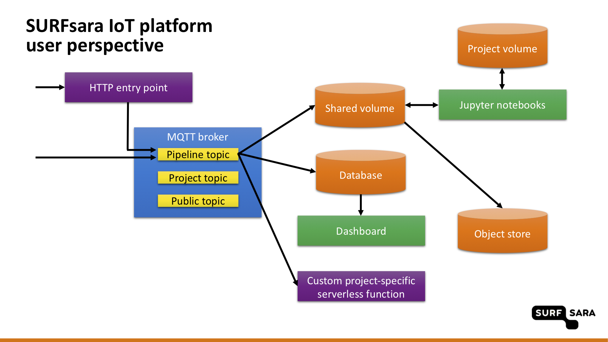

# User guide

This page show how to use individual components of the SURFsara IoT Platform for Sensemakers. Project are deployed with a **project user**. All data can be accessed using the **public user** account.

The following topics are covered below:
- [using MQTT](#mqtt)
- [using the HTTP entry point](#http-entry-point)
- [using InfluxDB](#influxdb)
- [using Minio](#minio)
- [using Grafana](#grafana)
- [using Jupyter](#jupyter)

An overview of the platform from the user perspective is shown here:




## MQTT

Clients can subscribe/publish messages to different topics. The following topics are defined:
- public topic for everyone to use,
- private topic for each project,
- topic for the [automated data pipeline](DATA.md#automated-data-pipeline).

The following table shows the access rights for different users:

| | **admin** user | **project1** user | **project2** user | **public** user |
| :---- | :---- | :---- | :---- | :---- |
| **public** topic | read/write | read/write | read/write | read/write |
| **pipeline/project1** topic | read/write | read/write | read-only | read-only |
| **pipeline/project2** topic | read/write | read-only | read/write | read-only |
| **project1** topic | read/write | read/write | no access | no access |
| **project2** topic | read/write | no access | read/write | no access | 

The examples below show how to interact with the Mosquitto broker using command-line clients.

Subscribe to the `public` topic and publish a message in any format to that topic:

```sh
mosquitto_sub -t public -h mqtt.sensemakersams.org -p 9998 -u public -P $PUBLIC_PASSWORD
mosquitto_pub -t public -m 42 -h mqtt.sensemakersams.org -p 9998 -u public -P $PUBLIC_PASSWORD
```

Subscribe to the project-specific topic and publish a message in any format to that topic:

```sh
mosquitto_sub -t $PROJECT_NAME -h mqtt.sensemakersams.org -p 9998 -u $PROJECT_NAME -P $PROJECT_PASSWORD
mosquitto_pub -t $PROJECT_NAME -m 42 -h mqtt.sensemakersams.org -p 9998 -u $PROJECT_NAME -P $PROJECT_PASSWORD
```

The automated pipeline uses a topic composed of `pipeline/app_id/dev_id` where `app_id` and `dev_id` are the unique project identifier (project name) within the platform and the unique device identifer (device name) within the project, respectively.

Listen to all messages from the automated pipeline:

```sh
mosquitto_sub -t pipeline/# -h mqtt.sensemakersams.org -p 9998 -u public -P $PUBLIC_PASSWORD
```

Listen to all messages from the automated pipeline from a specific project:

```sh
mosquitto_sub -t pipeline/$PROJECT_NAME/+ -h mqtt.sensemakersams.org -p 9998 -u public -P public1234
```

Send a message to the automated pipeline:

```sh
mosquitto_pub -t pipeline/$PROJECT_NAME/test_device \
    -m '{"app_id": "'$PROJECT_NAME'", "dev_id": "test_device", "payload_fields": {"temperature": 42}}' \
    -h mqtt.sensemakersams.org -p 9998 \
    -u $PROJECT_NAME -P $PROJECT_PASSWORD
```

The `pipeline` topic only accepts messages in a specific format, see the [data format](DATA.md#data-format) section for more details.


## HTTP entry point

Besides sending data to the automated pipeline with the Mosquitto command-line client, it is possible to use the HTTP entry point. This entry point publishes the received messages to the MQTT broker.

```sh
curl –XPOST https://openfaas.sensemakersams.org/function/faas-mqtt --data \
  '{"app_id": "'$PROJECT_NAME'", "dev_id": "test_device", "payload_fields": {"temperature": 42}}’ \
  -H "X-Api-Key:$PROJECT_PASSWORD"
```

The entry point works well with [The Things Network HTTP integration](https://www.thethingsnetwork.org/docs/applications/http/).
In principle, `app_id` used in The Things Network does not have to coincide with `app_id` used in this platform. It is possible to override `app_id` in a URL query paramter, e.g. `https://openfaas.sensemakersams.org/function/faas-mqtt?app_id=test_project`.

A URL query paramter can also be used to override the MQTT user, which is identical from `app_id` otherwise. This is useful when sending data for multiple projects as the admin user.

```sh
curl –XPOST https://openfaas.sensemakersams.org/function/faas-mqtt?mqtt_user=admin --data \
  '{"app_id": "test_project", "dev_id": "test_device", "payload_fields": {"temperature": 42}}’ \
  -H "X-Api-Key:$ADMIN_PASSWORD"
```


## InfluxDB

Every projects is given project-specific user and database in InfluxDB.
Messages sent to the [automated data pipeline](DATA.md#automated-data-pipeline) are immediately replicated to the database related to the project for the period of 90 days. All values in a message are stored in the time series belonging to the specific device.

The following table shows the access rights for different users:

| | **admin** user | **public** user |
| :---- | :---- | :---- |
| **project1** database | read/write | read-only |
| **project2** database | read/write | read-only |

Data can be accessed using the [influx command-line client](https://docs.influxdata.com/influxdb/v1.7/tools/shell/).

First, connect to the database in InfluxDB for your project:

```sh
influx -host influxdb.sensemakersams.org \
    -port 443 -ssl \
    -username public \
    -password $PUBLIC_PASSWORD \
    -database $PROJECT_NAME
```

Next, show the available measurements and series:

```
> SHOW MEASUREMENTS
> SHOW SERIES
```

Make sure timestamps are shown human-readable:

```
> precision rfc3339
```

Inspect tags:

```
> SHOW TAG KEYS
> SHOW TAG KEYS FROM "357518080332281"
> SHOW TAG VALUES WITH KEY = "name"
> SHOW TAG VALUES FROM "357518080332281" WITH KEY = "name"
```

Show what quantities are measured by individual devices. The first example shows the quantities for all devices, the second example shows only the quantites from the device called `357518080332281`.

```
> SHOW FIELD KEYS
> SHOW FIELD KEYS FROM "357518080332281"
```

Some example queries:

```
> SELECT * FROM "357518080332281"
> SELECT * FROM "357518080332281" WHERE time > now() - 1h
> SELECT * FROM /.*/ ORDER BY DESC LIMIT 1
> SELECT * FROM /.*/ WHERE "name"::tag = 'EC 242'
> SELECT waterTemperature FROM "357518080332281"
```

The influx client can be used to download data in a CSV or JSON format:

```sh
influx -host influxdb.sensemakersams.org \
    -port 443 -ssl \
    -username public \
    -password $PUBLIC_PASSWORD \
    -database $PROJECT_NAME \
    -precision rfc3339 \
    -execute "SELECT * FROM \"357518080332281\"" -format csv
name,time,FixAge,Lat,Lon,SatInFix,TimeActive,altitude,batteryVoltage,boardTemperature,course,dev_id,imei,lastResetCause,name,speed,timestamp,waterEC,waterTemperature
357518080332281,2019-07-10T00:41:19.831Z,255,0.0000255,0.0000255,0,26231,0,3.96,24,0,357518080332281,357518080332281,32,EC 242,0,1562719373,0,22.85
357518080332281,2019-07-10T00:56:19.83Z,255,0.0000255,0.0000255,0,27131,0,3.96,24,0,357518080332281,357518080332281,32,EC 242,0,1562720273,0,22.85
357518080332281,2019-07-10T01:26:31.395Z,255,0.0000255,0.0000255,0,28930,0,3.96,24,0,357518080332281,357518080332281,32,EC 242,0,1562722072,3,22.85
357518080332281,2019-07-10T01:56:19.455Z,255,0.0000255,0.0000255,0,30730,0,3.96,24,0,357518080332281,357518080332281,32,EC 242,0,1562723872,0,22.94
357518080332281,2019-07-10T02:26:19.146Z,255,0.0000255,0.0000255,0,32530,0,3.96,24,0,357518080332281,357518080332281,32,EC 242,0,1562725672,0,22.94
357518080332281,2019-07-10T02:41:19.817Z,255,0.0000255,0.0000255,0,33431,0,3.96,24,0,357518080332281,357518080332281,32,EC 242,0,1562726573,0,22.94
357518080332281,2019-07-10T02:56:19.121Z,255,0.0000255,0.0000255,0,34331,0,3.96,23,0,357518080332281,357518080332281,32,EC 242,0,1562727473,0,22.85
357518080332281,2019-07-10T03:26:19.089Z,255,0.0000255,0.0000255,0,36131,0,3.96,24,0,357518080332281,357518080332281,32,EC 242,0,1562729273,1,22.94
357518080332281,2019-07-10T03:41:19.249Z,255,0.0000255,0.0000255,0,37031,0,3.96,24,0,357518080332281,357518080332281,32,EC 242,0,1562730173,0,22.85
```

Alternatively, one can interact with the database through [InfluxDB HTTP endpoints](https://docs.influxdata.com/influxdb/v1.7/tools/api/). An example is given below.

```sh
curl "https://influxdb.sensemakersams.org/query?u=public&p=$PUBLIC_PASSWORD" \
    --data-urlencode "db=$PROJECT_NAME" \
    --data-urlencode "q=SHOW MEASUREMENTS"
```

This is how to obtain data in a CSV format:

```sh
curl -XPOST \
  "https://influxdb.sensemakersams.org/query?u=public&p=$PUBLIC_PASSWORD" \
  --data-urlencode "db=$PROJECT_NAME" \
  --data-urlencode "q=SELECT * FROM \"357518080332281\"" | jq -r \
  "(.results[0].series[0].columns), (.results[0].series[0].values[]) | @csv"
```


## Minio

Minio serves as a long-term data storage of raw messages sent to the [automated data pipeline](DATA.md#automated-data-pipeline). The messages are uploaded to Minio on a daily basis. Minio uses so-called buckets for storing objects:
- **data** bucket holds the raw messages in the JSON format. The messages are organised in folders according to the projects and files for a given device and a calendar date. It is the date of the arrival of each message to the data platform that determines to which file the message is appended, not the actual timestamp reported in the message. The naming convention is `app_id/dev_id-YYYY-mm-dd.json`.
- **metadata** bucket holds the metadata in the JSON format extracted from every data file. The naming convention is the same as above.

The following table shows the access rights for different users:

| | **admin** user | **public** user |
| :---- | :---- | :---- |
| **data** bucket | read/write | read-only |
| **metadata** bucket | read/write | read-only |

The Minio object store has a web UI that can be accessed at https://minio.sensemakersams.org. From the UI, it is easy to see and download data with a click of a button.

For command-line access, use the [mc client](https://github.com/minio/mc). To initialise the Minio client with the Minio instance in the platform, use Minio config:

```sh
mc config host add sensemakers \
    https://minio.sensemakersams.org \
    public $PUBLIC_PASSWORD \
    --api s3v4
```

Example usage:
- List files:
```sh
mc ls sensemakers
mc ls sensemakers --recursive
mc ls sensemakers/data/mijnomgeving
```

- Copy files:
```sh
mc cp sensemakers/data/mijnomgeving/357518080330582-2019-10-06.json .
mc cp --recursive sensemakers/data/mijnomgeving .
```

- Copy files using wildcards:
```sh
mc find sensemakers/data/mijnomgeving --name "357518080330582*.json" --exec "mc cp {} ."
```

- Investigate contents of a file:
```sh
mc cat sensemakers/metadata/mijnomgeving/357518080330582-2019-10-06.json
mc head -n 42 sensemakers/data/mijnomgeving/357518080330582-2019-10-06.json

mc sql --query "SELECT s.time,s.dev_id,s.payload_fields.waterTemperature FROM S3Object s" sensemakers/data/mijnomgeving/
mc sql --query "SELECT * FROM S3Object" sensemakers/metadata/mijnomgeving/
```

More information on the use of the client can be found in the [Minio documentation](https://docs.min.io/docs/minio-client-complete-guide).


## Grafana

Grafana dashboards can be accessed at https://grafana.sensemakersams.org. The dashboards in Grafana are organised in folders. Besides the monitoring folder with dashboards showing metrics about the plafrom performance and usage, every project is given a folder to create dashboards with custom data visualisations.
See the [Grafana documentation](https://grafana.com/docs/) for more details.

The following table shows the access rights for different users:

| | **admin** user | **project1** user | **project2** user | **public** user |
| :---- | :---- | :---- | :---- | :---- |
| **monitoring** folder | view/edit | no access | no access | no access |
| **project1** folder | view/edit | view/edit | view | view |
| **project2** folder | view/edit | view | view/edit | view |


## Jupyter

JupyterHub is available at https://jupyter.sensemakersams.org/hub/login. Every project gets its user account and a private project volume for saving notebooks and data produced by the notebooks.

As explained in the [automated data pipeline](DATA.md#automated-data-pipeline) section, a shared volume is available in the platform to aggreage raw messages before they are uploaded to Minio. This shared volume is readable from the Jupyter notebooks under `/home/shared`, giving access to the files with historical and new messages.

The following table gives a summary of the access rights for different users:

| | **admin** user | **project1** user | **project2** user |
| :---- | :---- | :---- | :---- |
| **shared volume** | read-only | read-only | read-only |
| **admin** private volume | read/write | no access | no access |
| **project1** private volume | no access | read/write | no access |
| **project2** private volume | no access | no access | read/write |
